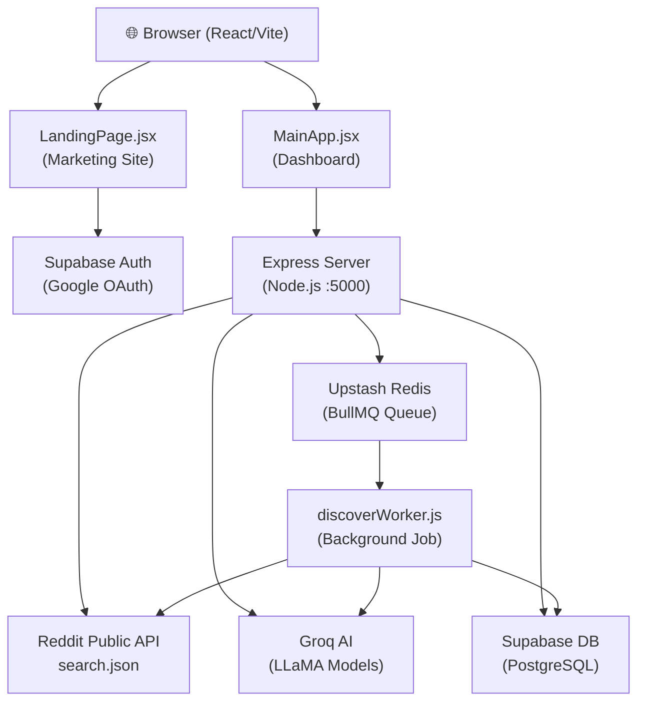
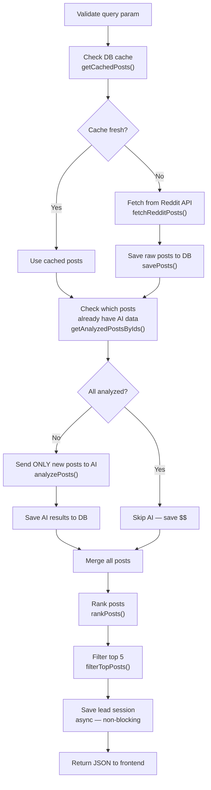
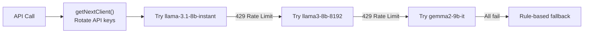
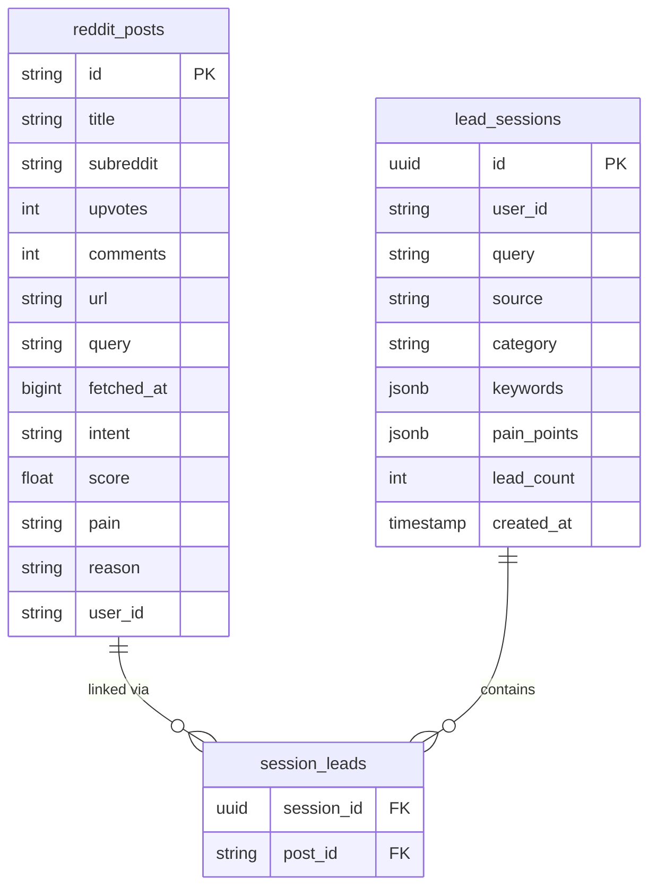
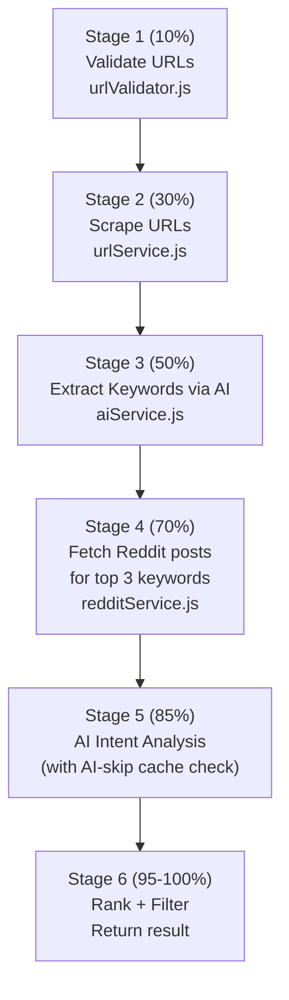
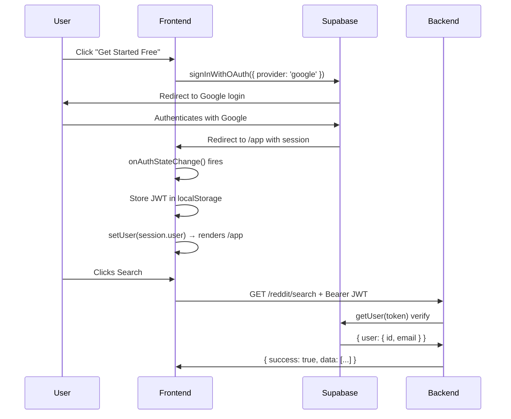
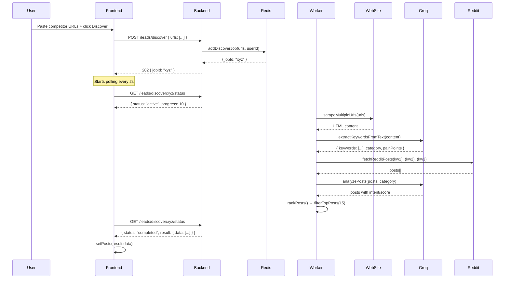
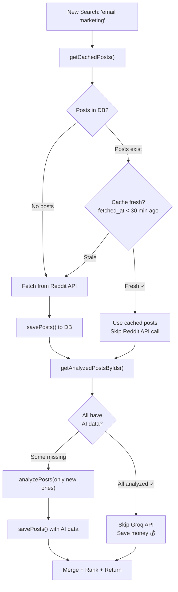

# LeadRadar — Full Codebase Report

## What Is This App?

**LeadRadar** is a SaaS product that helps founders and marketers find high-intent Reddit posts — people who are **actively complaining about a problem your product solves**. It uses AI to classify, score, and rank those posts so you can reach out to real buyers.

---

## 1. Full Architecture Overview



---

## 2. Folder Structure

```
reddit-saas/
├── server/                   ← Node.js backend
│   └── src/
│       ├── server.js         ← Entry point
│       ├── app.js            ← Express setup
│       ├── config/
│       │   ├── supabase.js   ← DB client
│       │   └── redis.js      ← Queue client
│       ├── middleware/
│       │   └── authMiddleware.js  ← JWT guard
│       ├── routes/
│       │   ├── redditRoutes.js    ← Search + Discover APIs
│       │   └── leadsHistoryRoutes.js ← History CRUD
│       ├── services/
│       │   ├── redditService.js   ← Fetch from Reddit
│       │   ├── aiService.js       ← Groq AI analysis
│       │   ├── redditRepository.js ← All DB queries
│       │   ├── rankingService.js  ← Score + rank posts
│       │   └── urlService.js      ← Web scraper
│       ├── jobs/
│       │   ├── discoverQueue.js   ← BullMQ queue
│       │   └── discoverWorker.js  ← Background processor
│       └── utils/
│           ├── cache.js           ← TTL freshness check
│           ├── logger.js          ← Winston logger
│           ├── validators.js      ← Zod input validation
│           └── urlValidator.js    ← SSRF protection
└── frontend/                 ← React/Vite frontend
    └── src/
        ├── main.jsx          ← ReactDOM root
        ├── App.jsx           ← Router + auth state
        ├── auth/
        │   ├── supabaseClient.js  ← Supabase browser client
        │   └── authService.js     ← login/logout helpers
        ├── services/
        │   └── api.js            ← All fetch() calls to backend
        ├── pages/
        │   ├── LandingPage.jsx   ← Public marketing page
        │   └── MainApp.jsx       ← Authenticated dashboard
        └── components/
            ├── Sidebar.jsx       ← History sidebar
            ├── Results.jsx       ← Results container
            ├── LeadCard.jsx      ← Single lead display
            └── SearchBar.jsx     ← Search input
```

---

## 3. File-by-File Breakdown

### `server/src/server.js` — The Entry Point

**Why it exists:** This is the very first file Node runs. It boots everything.

```js
import "dotenv/config.js";     // Load .env variables first
import app from "./app.js";    // The Express app
import "./jobs/discoverWorker.js"; // Start background worker
const PORT = process.env.PORT || 5000;
app.listen(PORT, ...);
```

**What it does:**
- Loads environment variables (API keys, DB URLs)
- Imports and starts the Express app
- Imports the worker (this registers it so it starts listening to the queue)
- Catches any uncaught errors and logs them before crashing

---

### `server/src/app.js` — The Express App

**Why it exists:** Separates server startup from app configuration. A clean pattern.

**Middleware registered:**
| Middleware | Purpose |
|---|---|
| `helmet()` | Sets security HTTP headers |
| `express.json()` | Parses JSON request bodies |
| `cors()` | Allows requests from the frontend URL |
| Error handler | Catches all errors and returns structured JSON |

**Routes mounted:**
- `/` → `redditRoutes.js` (Search + Discover)
- `/` → `leadsHistoryRoutes.js` (History CRUD)

---

### `server/src/config/supabase.js` — Database Client

**Why it exists:** Creates a single Supabase admin client reused across all files.

Uses the `SUPABASE_SERVICE_KEY` (admin key — bypasses Row Level Security). The frontend uses the `ANON_KEY` instead.

**Crashes the server if the key is missing** — intentional, because nothing works without the DB.

---

### `server/src/config/redis.js` — Queue Client

**Why it exists:** Creates a single Redis connection for BullMQ.

Uses `ioredis` connecting to **Upstash Redis** (cloud Redis). `maxRetriesPerRequest: null` is required by BullMQ.

---

### `server/src/middleware/authMiddleware.js` — JWT Guard

**Why it exists:** Protects all API routes from unauthenticated users.

```
Request → Extract "Bearer <token>" from header
       → Ask Supabase to verify the JWT
       → If valid: attach user to req.user, call next()
       → If invalid: return 401
```

**Real-world analogy:** A bouncer at a club checking your wristband before letting you in.

---

### `server/src/routes/redditRoutes.js` — Core API Routes

Three routes:

#### `GET /reddit/search` — The Main Search Pipeline

This is the most complex and important route. 7-step flow:



**The AI-Skip Optimization:** If a post was analyzed before (e.g., from a previous search), it reuses the stored result instead of calling the AI again. This saves money.

#### `POST /leads/discover` — URL-Based Lead Discovery

- Accepts up to 5 competitor URLs
- Pushes a **BullMQ job** to the queue (non-blocking)
- Returns a `jobId` immediately (HTTP 202 Accepted)
- Frontend then polls for status

#### `GET /leads/discover/:jobId/status` — Job Polling

- Frontend calls this every 2 seconds
- Returns `{ status, progress, result }` 
- When `status === "completed"`, returns the leads

---

### `server/src/routes/leadsHistoryRoutes.js` — History CRUD

| Route | What it does |
|---|---|
| `GET /leads/history` | List all sessions for the logged-in user (paginated) |
| `GET /leads/history/:sessionId` | Get all leads for one session |
| `DELETE /leads/history/:sessionId` | Delete a session |

All routes are protected by `authMiddleware`.

---

### `server/src/services/redditService.js` — Reddit Fetcher

**Why it exists:** Fetches raw posts from Reddit's public JSON API.

**Key function: `fetchRedditPosts(query)`**

```
Input: "best CRM for small teams"
URL built: https://www.reddit.com/search.json?q=best+CRM+for+small+teams&limit=25
```

- Uses `AbortController` for a 10-second timeout
- Retries up to 3 times with exponential backoff (1s → 2s → 4s)
- Normalizes each post to: `{ id, title, subreddit, upvotes, comments, url, createdAt }`

---

### `server/src/services/aiService.js` — The AI Brain

**Why it exists:** Uses Groq's LLaMA models to classify Reddit posts by buyer intent.

#### Multi-Key + Multi-Model Rotation



**Why:** Groq free tier has rate limits. Rotating across 3 models and multiple API keys maximizes throughput.

#### `analyzePosts(posts, context)` — Bulk Analysis

- Splits posts into **chunks of 8**
- Sends each chunk in ONE AI call (batch = fewer API calls = cheaper)
- Returns each post enriched with `{ intent, score, pain, reason }`

**Intent levels:**
| Level | Score | Meaning |
|---|---|---|
| HIGH | 0.75–1.0 | Clear pain, wants a tool NOW |
| MEDIUM | 0.4–0.74 | Implicit need, software could help |
| LOW | 0.0 | Irrelevant, entertainment |

#### `extractKeywordsFromText(content)` — Keyword Extractor

- Used only in the Discover flow
- Uses the heavy `llama-3.3-70b-versatile` model
- Returns `{ category, painPoints, keywords[] }`

---

### `server/src/services/redditRepository.js` — All Database Logic

**Why it exists:** Single place for all Supabase queries. Clean separation.

#### Database Tables Used



#### Key Functions

| Function | What it does |
|---|---|
| `getCachedPosts(query)` | Get all posts for a query from DB |
| `savePosts(posts, query, userId)` | Upsert posts (insert or update) |
| `getAnalyzedPostsByIds(ids)` | Find which posts already have AI data |
| `saveLeadSession(userId, query, posts, meta)` | Create a session + link posts |
| `getUserLeadSessions(userId, page, limit)` | Paginated session history |
| `getSessionLeads(sessionId, userId)` | Get posts for a specific session |
| `deleteLeadSession(sessionId, userId)` | Delete a session |

---

### `server/src/services/rankingService.js` — Scoring Engine

**Why it exists:** AI intent alone isn't enough. A HIGH-intent post with 0 upvotes is less valuable than one with 500. This service combines all signals.

#### `rankPosts(posts)` — The Scoring Formula

```
finalScore = 
  (intentScore × 0.40)   ← AI classification (most important)
+ (aiScore     × 0.30)   ← AI confidence (0.0 to 1.0)
+ (engagement  × 0.20)   ← upvotes + comments, normalized
+ (recency     × 0.10)   ← newer posts score higher (decays over 72h)
```

**Real-world analogy:** Like a job recruiter scoring candidates on skills, experience, culture fit, and availability.

#### `filterTopPosts(posts, limit=5)`

- Always keeps HIGH + MEDIUM intent posts
- If fewer than `limit` exist, pads with best LOW posts
- Returns top N results

---

### `server/src/services/urlService.js` — Web Scraper

**Why it exists:** To extract text content from competitor websites for keyword analysis.

#### `scrapeUrl(url)`

```
URL → axios.get() → HTML string
    → cheerio loads HTML (like jQuery for Node)
    → Removes: script, style, nav, footer, header
    → Extracts body text
    → Trims to 5000 chars
    → Returns clean text
```

Uses `axios-retry` (3 retries with exponential backoff). Returns `null` on failure — never crashes the pipeline.

#### `scrapeMultipleUrls(urls)`

- Scrapes up to 5 URLs in **parallel** (`Promise.all`)
- Filters out nulls
- Returns array of text strings

---

### `server/src/jobs/discoverQueue.js` — Job Queue Setup

**Why it exists:** Creates the BullMQ queue that holds discover jobs.

```js
export const discoverQueue = new Queue("discover", { connection });
```

`addDiscoverJob(urls, userId)` adds a job with:
- 2 max attempts
- 30s exponential backoff on failure

---

### `server/src/jobs/discoverWorker.js` — Background Processor

**Why it exists:** Runs the heavy Discover pipeline in the background, not blocking the HTTP response.

#### 6-Stage Pipeline



Updates `job.progress` at each stage so the frontend can show a real progress bar.

---

### `server/src/utils/` — Utility Files

| File | Purpose |
|---|---|
| `cache.js` | `isCacheFresh(posts)` — checks if DB posts are within TTL (default 30 min) |
| `logger.js` | Winston logger with timestamps and color-coded levels |
| `validators.js` | Zod schemas — validates query string and URLs array |
| `urlValidator.js` | Prevents SSRF attacks by blocking internal IPs (127.x, 10.x, 192.168.x) |

---

## 4. Frontend File Breakdown

### `frontend/src/main.jsx` — React Entry Point

Mounts the React app into `<div id="root">` and wraps everything in `BrowserRouter` for routing.

---

### `frontend/src/App.jsx` — Root Component + Auth State

**What it does:**
1. On mount, calls `supabase.auth.getSession()` to check if user is already logged in
2. Stores the JWT token in `localStorage` (so `api.js` can use it)
3. Listens for auth state changes (handles OAuth redirect back from Google)
4. Routes:
   - `/` → `LandingPage` (always accessible)
   - `/app` → `MainApp` (requires login, redirects to `/` if not)
   - `*` → redirect to `/`

---

### `frontend/src/pages/LandingPage.jsx` — Marketing Page

A fully static marketing page with:
- Sticky navbar (changes style on scroll)
- Hero section with animated browser mockup
- "How it Works" 3-step section
- Features grid
- Comparison table (LeadRadar vs Manual)
- Pricing cards (Free / Starter / Pro)
- Footer

The `handleCTA` button: if user is logged in → goes to `/app`, else → triggers Google OAuth.

---

### `frontend/src/pages/MainApp.jsx` — The Dashboard

The core application. Manages all state:

```
State:
  posts[]          ← the lead results to display
  loading          ← show spinner?
  error            ← show error message?
  progressMsg      ← "50% — Fetching Reddit posts..."
  mode             ← "search" | "discover"
  query/urls       ← input values
  sessions[]       ← sidebar history
  activeSessionId  ← which session is selected
```

#### `handleSearch()` — Keyword Search Flow

```
User submits form
→ fetchLeads(query) → GET /reddit/search
→ setPosts(response.data)
→ loadHistory() to refresh sidebar
```

#### `handleDiscover()` — URL Discovery Flow

```
User submits URLs
→ discoverLeads(urls) → POST /leads/discover
→ Receive jobId
→ Start polling every 2s: checkJobStatus(jobId)
→ Update progressMsg each poll
→ When completed: setPosts(result.data)
```

#### `handleSelectSession()` — View Past Session

```
Click session in sidebar
→ getSessionLeads(session.id) → GET /leads/history/:id
→ setPosts(res.data)
```

---

### `frontend/src/auth/`

| File | Function | Does |
|---|---|---|
| `supabaseClient.js` | — | Creates Supabase browser client using `VITE_SUPABASE_URL` + `VITE_SUPABASE_ANON_KEY` |
| `authService.js` | `loginWithGoogle()` | Triggers Google OAuth, redirects to `/app` after |
| `authService.js` | `logout()` | Signs out of Supabase + clears localStorage token |

---

### `frontend/src/services/api.js` — All API Calls

Every function follows the same pattern:
```js
const token = localStorage.getItem("token");
fetch(URL, { headers: { Authorization: `Bearer ${token}` } })
```

| Function | HTTP | Endpoint |
|---|---|---|
| `fetchLeads(query)` | GET | `/reddit/search?query=...` |
| `discoverLeads(urls)` | POST | `/leads/discover` |
| `checkJobStatus(jobId)` | GET | `/leads/discover/:jobId/status` |
| `getLeadHistory(page)` | GET | `/leads/history` |
| `getSessionLeads(sessionId)` | GET | `/leads/history/:sessionId` |
| `deleteSession(sessionId)` | DELETE | `/leads/history/:sessionId` |

---

### `frontend/src/components/`

| Component | Props | Renders |
|---|---|---|
| `Sidebar.jsx` | user, sessions, activeSessionId, callbacks | Left panel with history list, delete buttons, logout |
| `Results.jsx` | posts[], info, sessionMeta | Info bar + list of `LeadCard` components |
| `LeadCard.jsx` | post | One lead: badge, title, stats, pain, AI reason, actions |
| `SearchBar.jsx` | mode, onSearch, disabled | Standalone search/discover form (used for reuse) |

#### `LeadCard` — The "Copy Reply Prompt" Feature

When clicked, copies a pre-built AI prompt to clipboard:
```
I need to reply to this Reddit post:
Title: <post title>
Pain Point: <extracted pain>
Goal: Write a helpful reply that subtly mentions your tool...
```

This is the **outreach engine** — users paste this into ChatGPT to generate personalized Reddit replies.

---

## 5. Complete Request Lifecycle — Tracing One Search

> User types **"email marketing tool"** and clicks Search

```
1. LeadCard clicks "Search →"
   └── handleSearch() fires in MainApp.jsx

2. fetchLeads("email marketing tool") in api.js
   └── GET http://localhost:5000/reddit/search?query=email+marketing+tool
   └── Header: Authorization: Bearer <JWT>

3. authMiddleware.js runs
   └── Extracts JWT from header
   └── Calls supabase.auth.getUser(token)
   └── Attaches user to req.user
   └── Calls next()

4. Route handler in redditRoutes.js
   ├── validateQuery() → "email marketing tool" ✓
   ├── getCachedPosts("email marketing tool") → checks DB
   │   └── 0 rows found → cache MISS
   ├── fetchRedditPosts("email marketing tool")
   │   └── GET https://www.reddit.com/search.json?q=email+marketing+tool&limit=25
   │   └── Returns 25 posts
   ├── savePosts(freshPosts, query, userId) → upserts to reddit_posts table
   ├── getAnalyzedPostsByIds([...25 ids]) → finds 0 already analyzed
   ├── analyzePosts(25 posts, null)
   │   └── Splits into 4 chunks of 8 (8+8+8+1)
   │   └── Sends each chunk to Groq LLaMA in one API call
   │   └── Parses JSON response with intent/score/pain/reason per post
   ├── savePosts(freshlyAnalyzed, query, userId) → saves AI results
   ├── Merges all 25 posts
   ├── rankPosts(25 posts) → calculates finalScore for each
   ├── filterTopPosts(ranked, 5) → returns top 5 HIGH/MEDIUM
   ├── saveLeadSession(userId, query, top5, meta) → async, non-blocking
   └── res.json({ success: true, data: top5 })

5. Frontend receives response
   └── setPosts(response.data) → React re-renders
   └── Results.jsx shows 5 LeadCards
   └── loadHistory() → refreshes sidebar
```

**Total time: ~3–8 seconds** (Reddit API + 4 AI calls)

---

## 6. Authentication Flow



---

## 7. Discover (URL-Based) Flow



---

## 8. Caching & Cost Optimization Strategy



**Two levels of caching:**
1. **Reddit API cache** (30 min TTL) — avoids hammering Reddit
2. **AI analysis cache** (permanent) — never re-analyze the same post twice

---

## 9. Environment Variables Reference

| Variable | Where | Purpose |
|---|---|---|
| `PORT` | Server | HTTP port (default 5000) |
| `SUPABASE_URL` | Server | Supabase project URL |
| `SUPABASE_SERVICE_KEY` | Server | Admin DB key (bypasses RLS) |
| `GROQ_API_KEY` | Server | Primary Groq AI key |
| `GROQ_API_KEY_1..N` | Server | Additional Groq keys for rotation |
| `REDIS_URL` | Server | Upstash Redis connection string |
| `CACHE_TTL_MINUTES` | Server | How long DB cache is fresh (default 30) |
| `VITE_SUPABASE_URL` | Frontend | Supabase URL (browser) |
| `VITE_SUPABASE_ANON_KEY` | Frontend | Public Supabase key |
| `VITE_API_URL` | Frontend | Backend URL |

---

## 10. Technology Stack Summary

| Layer | Technology | Why |
|---|---|---|
| Frontend | React 18 + Vite | Fast SPA, hot reload |
| Routing | react-router-dom | Client-side navigation |
| Styling | Vanilla CSS | Full control, no framework |
| Auth | Supabase Auth (Google OAuth) | No custom auth server needed |
| Backend | Node.js + Express | Fast, simple API server |
| AI | Groq (LLaMA 3.1/3, Gemma2) | Fastest inference, free tier |
| Database | Supabase (PostgreSQL) | Managed DB + auth in one |
| Queue | BullMQ + Upstash Redis | Reliable background jobs |
| Web Scraping | axios + cheerio | Simple HTML parsing |
| Validation | Zod | Type-safe schema validation |
| Logging | Winston | Structured, leveled logs |
| Security | helmet, SSRF protection | Production hardening |
