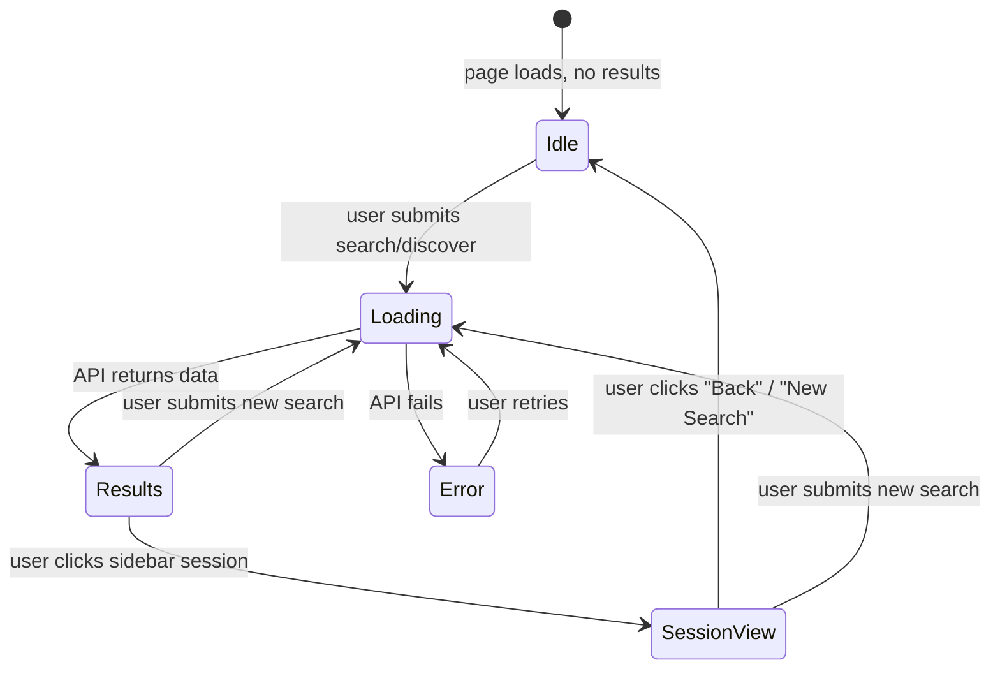
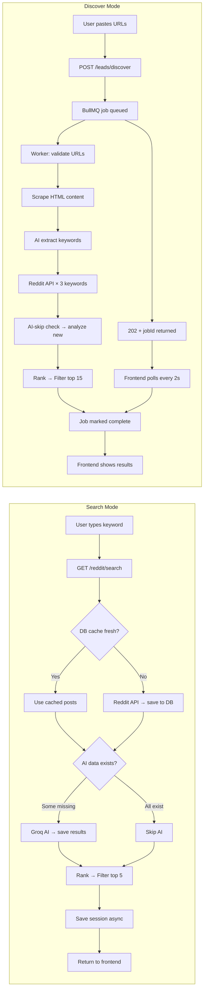

# LeadRadar — Deep Dive Report (Part 2)

> **Continues from Part 1** which covered the overall architecture, folder structure, and high-level flow diagrams.  
> This part goes **inside** each file — exact logic, design decisions, error handling, and things to watch out for.

---

## 11. `aiService.js` — Internals Deep Dive

### How the Client Pool Works

```js
let clients = [];          // Singleton array, built once
let currentClientIdx = 0;  // Round-robin pointer
```

`getGroqClients()` is lazy — it only builds the array the **first time** it's called. It reads:
- `GROQ_API_KEY` (primary)
- `GROQ_API_KEY_1`, `GROQ_API_KEY_2`, ... (extras)

`getNextClient()` returns the next client and advances the pointer with **modulo** so it wraps back to 0.

```
Keys: [KeyA, KeyB, KeyC]
Call 1 → KeyA  (idx becomes 1)
Call 2 → KeyB  (idx becomes 2)
Call 3 → KeyC  (idx becomes 0)
Call 4 → KeyA  (repeats)
```

**Why this matters:** Each API key has its own rate limit bucket. Rotating spreads load across keys.

---

### The Model Fallback Chain (exact code logic)

```
callWithModelFallback(messages):
  client = getNextClient()
  
  for model in ["llama-3.1-8b-instant", "llama3-8b-8192", "gemma2-9b-it"]:
    try:
      response = await Promise.race([
        client.chat.completions.create({ model, ... }),
        timeout(25s)           ← kills hanging requests
      ])
      return response          ← success, stop loop
    catch err:
      if err is 429 AND more models left:
        continue               ← try next model
      throw err                ← non-429 or all models exhausted
```

**Key insight:** The same `client` (API key) is used across all model attempts. Only the model name changes. If ALL 3 models are rate-limited on that key, it throws. The outer `analyzePosts` loop then applies rule-based fallback.

---

### The Batch Analysis Flow (`analyzePosts`)

```
Input: 25 posts, context = "B2B email marketing tool"

Loop (chunks of 8):
  Chunk 1: posts[0..7]  → 1 AI call → 8 results
  Chunk 2: posts[8..15] → 1 AI call → 8 results
  Chunk 3: posts[16..23]→ 1 AI call → 8 results
  Chunk 4: posts[24]    → 1 AI call → 1 result

Total: 4 AI calls (not 25!)
```

Each AI call gets posts formatted as:
```json
[
  { "id": 0, "title": "...", "content": "...(400 chars)", "subreddit": "..." },
  { "id": 1, "title": "...", ... }
]
```

The AI returns:
```json
{
  "results": [
    { "id": 0, "intent": "HIGH", "score": 0.88, "pain": "Can't automate email sequences", "reason": "..." },
    { "id": 1, "intent": "LOW",  "score": 0.0,  "pain": null, "reason": "Off-topic meme post" }
  ]
}
```

**What if the AI misses a post?** The code does `batchResults.find(r => String(r.id) === String(localIdx))`. If the result is missing → rule-based fallback for that specific post only.

---

### Rule-Based Fallback Logic

Used when ALL AI models fail for a chunk:

```js
const detectIntentRule = (title) => {
  const text = title.toLowerCase();
  if (text includes "best" OR "recommend" OR "tool" OR "software")
    return HIGH, 0.75
  if (text includes "how" OR "help" OR "problem")
    return MEDIUM, 0.5
  return null   // → final fallback: LOW, 0.0
}
```

**Limitation:** This is very naive. "How do I cook pasta?" would score MEDIUM. It's a last-resort safety net, not accurate classification.

---

### `extractKeywordsFromText` — Model Strategy Difference

| Function | Models tried | Token limit | Timeout |
|---|---|---|---|
| `analyzeIntentBatch` | 8b → 8b(v2) → 9b (light models) | 2000 | 25s |
| `extractKeywordsFromText` | **70b first**, then fallback to light | 400 | 15s |

The 70B model is used here because keyword extraction requires **understanding context and domain** — much harder than simple classification. But it has a much lower rate limit, so it falls back to lighter models on 429.

---

## 12. `rankingService.js` — The Math Explained

### Engagement Score Calculation

```js
engagement =
  normalize(upvotes,  maxUpvotes)  × 0.7
+ normalize(comments, maxComments) × 0.3
```

`normalize(value, max) = Math.min(1, value / max)`

**Example:** If max upvotes in batch = 1000:
- Post with 500 upvotes → 0.5 normalized → 0.5 × 0.7 = 0.35
- Post with 100 comments (max=200) → 0.5 normalized → 0.5 × 0.3 = 0.15
- Engagement = 0.50

### Recency Score

```js
recency = Math.max(0, 1 - diffHours / 72)
```

| Post age | Recency score |
|---|---|
| 0 hours old | 1.0 (full score) |
| 36 hours old | 0.5 |
| 72 hours old | 0.0 |
| 100 hours old | 0.0 (clamped) |

### Final Score Formula

```
finalScore = intentScore(0.4) + aiScore(0.3) + engagement(0.2) + recency(0.1)
```

**Example — two posts:**

| Field | Post A | Post B |
|---|---|---|
| intent | HIGH (1.0) | MEDIUM (0.6) |
| aiScore | 0.85 | 0.95 |
| engagement | 0.80 | 0.20 |
| recency | 0.90 | 0.10 |
| **finalScore** | **0.4+0.255+0.16+0.09 = 0.905** | **0.24+0.285+0.04+0.01 = 0.575** |

Post A wins despite Post B having a higher AI confidence — because engagement and recency are factored in.

### `filterTopPosts` Logic

```
Step 1: Collect all HIGH + MEDIUM posts
Step 2: If count < limit (5), pad with best LOW posts
Step 3: Slice to limit
```

**Edge case:** If there are 0 HIGH/MEDIUM posts (very rare), it returns the top 5 LOW posts sorted by finalScore.

---

## 13. `redditRepository.js` — Database Patterns

### The Upsert Pattern (`savePosts`)

```js
supabase.from("reddit_posts").upsert(payload, { onConflict: "id" })
```

**What this means:** If a post with the same Reddit `id` already exists → UPDATE it. If not → INSERT it.

**Why it matters:** The same Reddit post can appear in multiple searches. Upsert prevents duplicate rows and updates AI data on the same row when analysis is done later.

### The AI-Skip Query (`getAnalyzedPostsByIds`)

```js
supabase.from("reddit_posts")
  .select("*")
  .in("id", ids)          // Only these posts
  .not("intent", "is", null)  // Only rows that HAVE AI data
```

**The null check is the key:** A post exists in DB but `intent IS NULL` means it was saved before analysis. This query only returns posts where AI has already run — so the search route knows exactly which ones to skip.

### Session + Junction Table Insert

```
1. INSERT into lead_sessions → get back sessionId
2. INSERT many rows into session_leads:
   [{ session_id: "uuid", post_id: "reddit_id" }, ...]
```

This is a **many-to-many** relationship. One post can belong to multiple sessions (e.g., the same Reddit post appears in two different searches).

### Ownership Verification Pattern

Every sensitive query verifies `user_id` matches:

```js
supabase.from("lead_sessions")
  .select("*")
  .eq("id", sessionId)
  .eq("user_id", userId)  // ← Security check built into query
```

If the session belongs to a different user, Supabase returns null → 404 response. **No separate auth check needed** — it's enforced at the query level.

---

## 14. `discoverWorker.js` — Background Job Internals

### The Deduplication Step

After fetching Reddit posts for 3 keywords, many posts appear in multiple keyword results:

```js
const uniquePosts = Array.from(
  new Map(allPosts.map(p => [p.id, p])).values()
)
```

**How it works:** Creates a Map where the key is `post.id`. Duplicate IDs overwrite each other. Converting back to array gives unique posts only.

### Rate-Limit Graceful Degradation

```js
if (!keywords || keywords.length === 0) {
  // Don't throw — return partial result
  return {
    success: true, count: 0, data: [],
    warning: "AI models rate-limited. Try again in a few minutes."
  }
}
```

If keyword extraction fails (all models rate-limited), the job **completes successfully** with 0 results instead of failing. This prevents BullMQ from retrying immediately (which would just hit the rate limit again).

### Error Classification

```js
const isRateLimit = error.message?.includes("429") || error.message?.includes("rate_limit");

if (isRateLimit) {
  return { success: false, error: "AI rate limit reached..." }  // Soft fail
}

throw error  // Hard fail → BullMQ retries
```

Only non-rate-limit errors get re-thrown to trigger BullMQ's retry mechanism (2 attempts, 30s backoff).

### Progress Updates

```js
await job.updateProgress({ step: 10, message: "Validating URLs..." })
await job.updateProgress({ step: 30, message: "Scraping content..." })
// etc.
```

The frontend polls `/leads/discover/:jobId/status` every 2 seconds. The status route reads `job.progress` and returns it. The frontend then shows: `"30% — Scraping content from URLs..."`

---

## 15. `cache.js` — The TTL Trick

```js
const CACHE_TTL_MINUTES = parseInt(process.env.CACHE_TTL_MINUTES || '2', 10);
```

> ⚠️ **Gotcha:** The `.env` file has `CACHE_TTL_MINUTES= 30` (with a space). `parseInt(" 30", 10)` correctly parses to `30`. But if someone changes the format, it could silently fall back to `2` minutes.

The freshness check:

```js
const latestTime = Math.max(...posts.map(p => Number(p.fetched_at) || 0));
const ageMs = Date.now() - latestTime;
return ageMs <= CACHE_TTL_MS;
```

**It checks the NEWEST post in the batch.** If any post was fetched within TTL, the whole cache is considered fresh. This means even if you have 24 stale posts and 1 fresh post, it returns cache HIT.

---

## 16. Security Architecture

### Layer 1 — HTTP Security Headers (`helmet`)

Applied in `app.js`. Sets headers like:
- `X-Content-Type-Options: nosniff`
- `X-Frame-Options: DENY`  
- `Content-Security-Policy`

### Layer 2 — CORS

```js
cors({ origin: process.env.FRONTEND_URL })
```

Only the frontend URL can make cross-origin requests.

### Layer 3 — Rate Limiting

| Route | Limit | Window |
|---|---|---|
| `/reddit/search` | 100 req | 15 min |
| `/leads/discover` | 20 req | 15 min |

Applied via `express-rate-limit` on individual routes (not globally).

### Layer 4 — JWT Authentication (`authMiddleware.js`)

```
Header: Authorization: Bearer <JWT>
  ↓
supabase.auth.getUser(token)
  ↓
If valid → req.user = { id, email, ... }
If invalid → 401 Unauthorized
```

**Every protected route** has `protect` as middleware. Unauthenticated requests never reach business logic.

### Layer 5 — SSRF Protection (`urlValidator.js`)

When users submit competitor URLs for the Discover feature:

```
Input URL → DNS resolve hostname → Get IP
  ↓
Block if IP starts with:
  127.x     (localhost)
  10.x      (private network)
  192.168.x (private network)  
  169.254.x (link-local / AWS metadata)
```

**Why 169.254.x matters:** AWS EC2 instance metadata is at `169.254.169.254`. Without this check, an attacker could submit that URL and read your AWS credentials.

### Layer 6 — Input Validation (Zod)

```js
// Query: must be non-empty string
z.string().trim().min(1)

// URLs: array of 1-5 valid URLs
z.array(z.string().url()).min(1).max(5)
```

Zod throws `ZodError` → caught → returns clean error message to client. No raw Zod objects leak to the user.

---

## 17. Frontend State Machine

`MainApp.jsx` manages 4 distinct UI states:



### The `isIdle` Condition

```js
const isIdle = !loading && !hasResults && !activeSessionMeta && !error;
```

Only when ALL FOUR conditions are true does the welcome screen show. This prevents the welcome screen from flickering during state transitions.

### Discover Polling Loop

```js
const poll = async () => {
  const statusRes = await checkJobStatus(response.jobId);
  
  if (statusRes.status === "completed") { ... return; }  // Stop polling
  if (statusRes.status === "failed")    { ... return; }  // Stop polling
  
  setProgressMsg(`${statusRes.progress}% — ${statusRes.message}`);
  setTimeout(poll, 2000);  // Schedule next poll
};
poll();  // Start immediately
```

**Design note:** Uses `setTimeout` (not `setInterval`) so polls don't stack up if the server is slow. Each poll waits for the previous response before scheduling the next.

---

## 18. Known Gotchas & Things to Watch

### 1. Cache TTL Space Bug

`.env` line: `CACHE_TTL_MINUTES= 30` has a leading space after `=`. Works with `parseInt` but could break if the code ever uses `Number()` or string comparison directly.

### 2. Worker Uses `"analyzed_cache"` as Query String

```js
await savePosts(newlyAnalyzedPosts, "analyzed_cache", userId);
```

Posts analyzed in the Discover flow are saved with query `"analyzed_cache"` — not the actual keyword. This means `getCachedPosts("analyzed_cache")` would return ALL discover-analyzed posts. This is intentional (they're only cached by ID lookup via `getAnalyzedPostsByIds`) but confusing.

### 3. Double Results Render

In `MainApp.jsx`:

```jsx
{!loading && hasResults && (
  <Results posts={posts} ... />
)}

{/* Session results (no search bar shown) */}
{!loading && activeSessionMeta && (
  <Results posts={posts} ... />
)}
```

If `hasResults` AND `activeSessionMeta` are both true simultaneously, `<Results>` renders **twice**. In practice this doesn't happen because `handleSelectSession` sets `posts` after clearing it, but it's a latent bug.

### 4. No Job Cleanup

BullMQ jobs remain in Redis after completion. Over time, completed/failed jobs accumulate in Upstash Redis. There's no `removeOnComplete` or `removeOnFail` configuration in `discoverQueue.js`. For production, add:

```js
new Queue("discover", {
  connection,
  defaultJobOptions: {
    removeOnComplete: 100,  // Keep last 100 completed
    removeOnFail: 50,
  }
})
```

### 5. Single Groq API Key in `.env`

Currently only `GROQ_API_KEY` is set — no `GROQ_API_KEY_1` etc. The multi-key rotation system is built and works, but only one key is configured, so all calls use the same key.

### 6. Progress Bar Parsing Bug

```jsx
<div className="progress-bar" style={{ width: `${parseInt(progressMsg) || 30}%` }} />
```

`parseInt("30% — Scraping...")` correctly returns `30`. But `parseInt("Validating URLs...")` returns `NaN` → falls back to `30%`. The bar will always show 30% on the first stage regardless of actual progress.

---

## 19. Data Flow Summary (Both Modes)



---

## 20. Production Readiness Checklist

| Area | Status | Notes |
|---|---|---|
| Auth | ✅ | JWT via Supabase, all routes protected |
| Input Validation | ✅ | Zod on all inputs |
| SSRF Protection | ✅ | DNS-based IP block |
| Rate Limiting | ✅ | Per-route limiters |
| Security Headers | ✅ | helmet() |
| Error Handling | ✅ | Global error handler in app.js |
| AI Rate Limit Resilience | ✅ | Multi-model + multi-key fallback |
| DB Caching | ✅ | 30-min TTL + permanent AI cache |
| Background Jobs | ✅ | BullMQ + Upstash Redis |
| Logging | ✅ | Winston structured logs |
| Job Cleanup | ❌ | No removeOnComplete configured |
| Multiple Groq Keys | ⚠️ | System built, only 1 key active |
| Progress Bar Bug | ⚠️ | Always shows 30% on stage 1 |
| Double Render Risk | ⚠️ | Latent bug in MainApp.jsx |
| HTTPS | ⚠️ | Depends on deployment (Render/Railway) |
| DB Indexes | ❓ | Unknown — check Supabase for indexes on `query`, `user_id`, `intent` columns |
